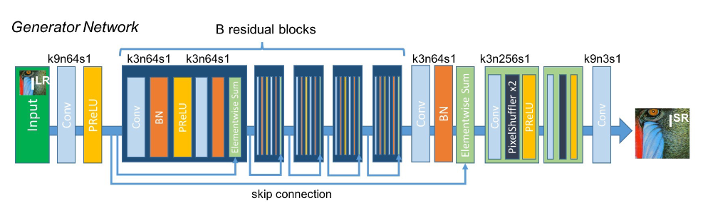
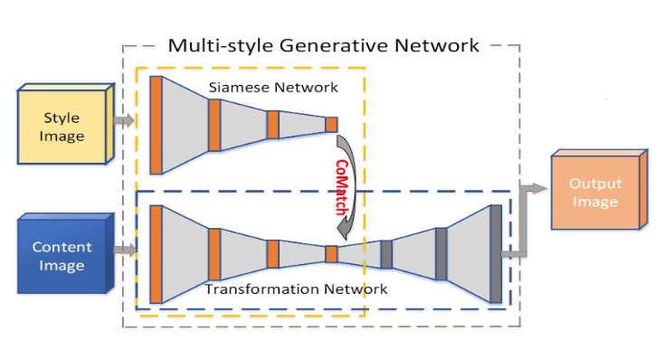
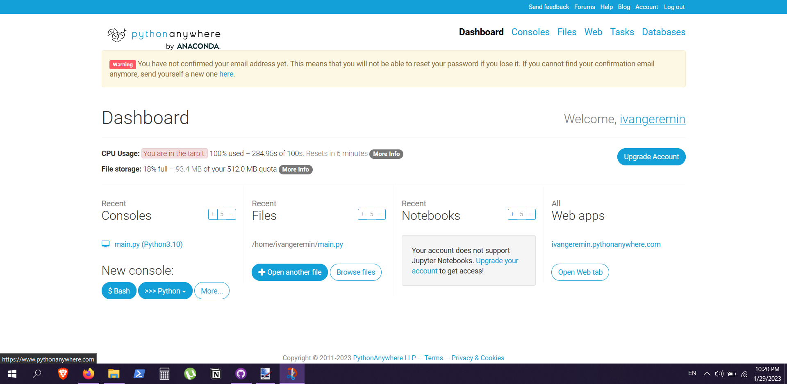
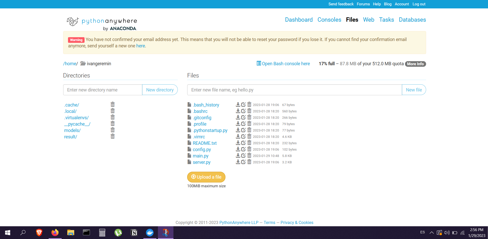
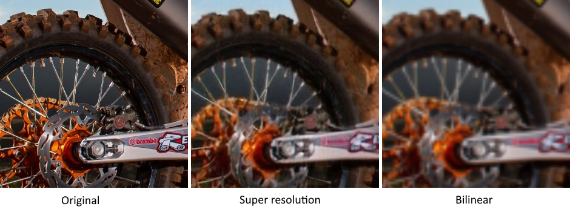
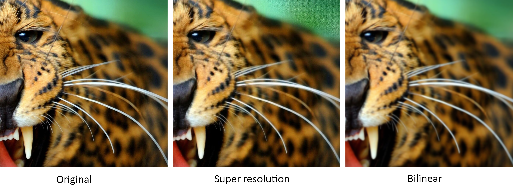
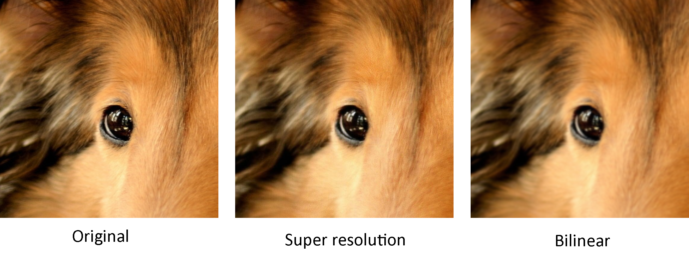
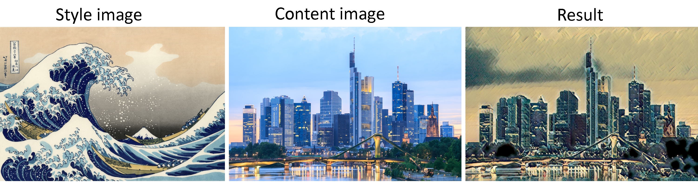

# Neural Style Telegram bot
 
Final project for the DLS School course, fall 2023 \
Ivan Eremin
Stepik ID: [465994370](https://stepik.org/users/465994370)


## Introduction 

The purpose of this project is to create a Telegram bot for working with images using neural networks. Two functions were implemented: super resolution and style transfer.

[Video of a running bot](https://raw.githubusercontent.com/IGEremin/Neural-Style-Telegram-Bot/main/img/style_bot_running.mp4)

### Super resolution

The Super Resolution model is based on Super-Resolution Generative Adversarial Network ([SRGAN](https://arxiv.org/pdf/1609.04802.pdf))



At the implementation stage, part of the discriminator was removed from the model.

### Style transfer

The Style Transfer model is based on Multi-style Generative Network for Real-time Transfer ([MSG-Net](https://arxiv.org/pdf/1703.06953.pdf))



## Hosting

[Link](https://t.me/searchAliceBot) to the running bot. It hosts in [Pythonanywhere](https://www.pythonanywhere.com).



<br/>


## Github

Clone this repository to your system.

```
$ git clone https://github.com/IGEremin/Neural-Style-Telegram-Bot
```

Make sure that Python3 is installed in your computer. Open the master directory in the terminal and install the dependencies from `requirements.txt` via this command:

```
$ pip install -r requirements.txt
```

Now, everything is ready to run the bot. 

```
$ python main.py ""1234567890:ABCDEFGHjklmnopqrstUVWXYZabcdefghJK""
```
The argument "1234567890:ABCDEFGHjklmnopqrstUVWXYZabcdefghJK" is an example of bot token.

## Docker Hub

You can pull docker image from Docker Hub.

```
$ docker image pull ivaneremin/style_bot
```

And run it on your system. The argument "1234567890:ABCDEFGHjklmnopqrstUVWXYZabcdefghJK" is an example of bot token.

```
$ docker run ivaneremin/style_bot "1234567890:ABCDEFGHjklmnopqrstUVWXYZabcdefghJK"
```

## Results

### Super resolution





### Style transfer




<!-- # Contact 

Feel free to reach out you find any issue with the code or if you have any questions.

* Personal email: eremin.ivan@yahoo.com -->

## License 

```
MIT License

Copyright (c) 2020 Ivan Eremin

Permission is hereby granted, free of charge, to any person obtaining a copy
of this software and associated documentation files (the "Software"), to deal
in the Software without restriction, including without limitation the rights
to use, copy, modify, merge, publish, distribute, sublicense, and/or sell
copies of the Software, and to permit persons to whom the Software is
furnished to do so, subject to the following conditions:

The above copyright notice and this permission notice shall be included in all
copies or substantial portions of the Software.

THE SOFTWARE IS PROVIDED "AS IS", WITHOUT WARRANTY OF ANY KIND, EXPRESS OR
IMPLIED, INCLUDING BUT NOT LIMITED TO THE WARRANTIES OF MERCHANTABILITY,
FITNESS FOR A PARTICULAR PURPOSE AND NONINFRINGEMENT. IN NO EVENT SHALL THE
AUTHORS OR COPYRIGHT HOLDERS BE LIABLE FOR ANY CLAIM, DAMAGES OR OTHER
LIABILITY, WHETHER IN AN ACTION OF CONTRACT, TORT OR OTHERWISE, ARISING FROM,
OUT OF OR IN CONNECTION WITH THE SOFTWARE OR THE USE OR OTHER DEALINGS IN THE
SOFTWARE.
```
 
